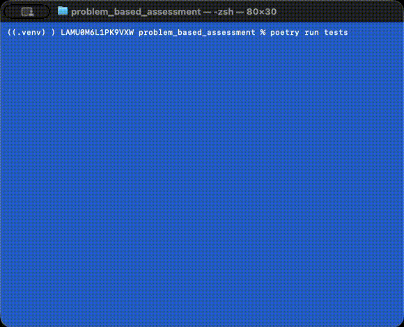
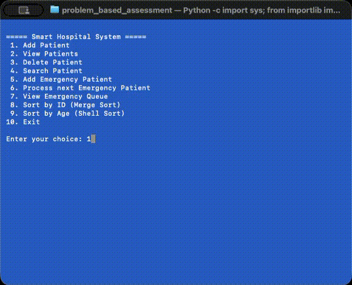
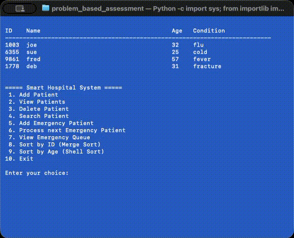
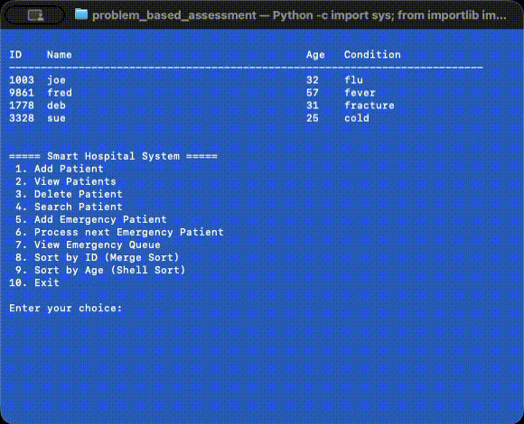
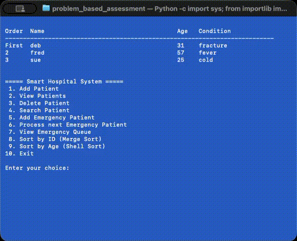
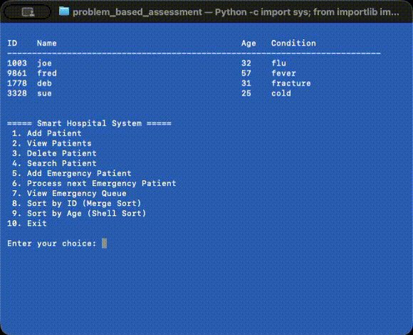
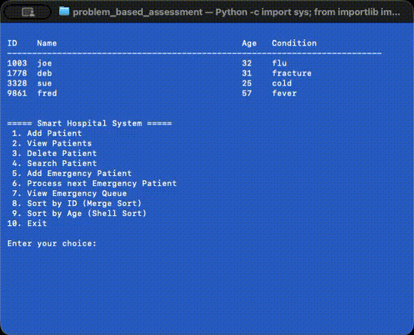

# CMPU2032 - Programming & Algorithms 2 (2025/26) <br/> <p style="font-size:16pt; font-style: italic">Project Report</p>

<br/><br/>

**Student Name:** *Dwight Egerton*

**Student ID:** *D24127624*

**Release Date:** *16 April 2026*

**Submission Date:** *3 May 2026 @ 23:59*

<br/><br/>

---

## Overview

### Assignment Description

A hospital wants to digitize its patient handling system. You are hired to develop a Python-based system that efficiently manages patient records, emergency cases, and data processing using appropriate data structures and algorithms.

### Problem Statement

Design and implement a menu-driven Python program that demonstrates the use of following requirements:

## Table of Contents

1. [Explanation of the data structures used](#explanation-of-the-data-structures-used)
2. [Description of sorting algorithms implemented](#description-of-sorting-algorithms-implemented)
3. [Test cases](#test-cases)
4. [Explanation of the design pattern selected](#explanation-of-the-design-pattern-selected)
5. [Sample outputs of the program](#sample-outputs-of-the-program)
6. [Setup and Execution](#setup-and-execution)

<div style="page-break-before:always"></div>

---

## Project Report

### Explanation of the data structures used

There were three core structures used to manage the "Smart Hospital System" data.
The breakdown of these are listed below: -

1. **[Patient Data-Class](https://github.com/D24127624/CMPU2032-PBA/blob/main/problem_based_assignment/src/pba/patient.py)**

    * Simple data structure `Patient`, used to store patient details loaded into the system.
    * Keep the details to the basics: `id`, `name`, `age` & `condition`.
    * Included data-type validation to ensure `id` and `age` are integers.

2. **[Patient Records Linked-List](https://github.com/D24127624/CMPU2032-PBA/blob/main/problem_based_assignment/src/pba/patient_records.py)**

    * The `PatientRecords` class implements a simple linked-list. This class keeps track of the `head` and `tail` node in the linked list.
    * Uses a `head` node to track the start of the list, with `tail` node tracking the end of the list.
    * There is a `LinkNode` data-class that is used to manage/store each node in the linked-list.
    * The `LinkNode` will hold the `Patient` record as-well-as the next `LinkNode` in the list (if applicable).
    * This linked-list can bee accessed via the following operations: -
        - *Add Patient* `add_patient(patient: Patient) -> bool`: adds a new `Patient` record to the end of the linked list. Returns a `boolean` to the calling program to indicate if this was completed successfully.
        - *Delete Patient* `delete_patient(patient_id: int) -> Patient | None`: removes a `Patient` record from the list based on the provided `patient_id`. This will also ensure that the list linking is maintained. The removed `Patient` record (or `None` if not found) is returned to the calling program.
        - *Find Patient* `find_patient(patient_id: int) -> Patient | None`: using the provided `ID`, find and return the respective `Patient` record. This will return the found `Patient` record or `None` if not found.
        - *List Patients* `list_patients() -> list[Patient]`: returns all the `Patient` records in the linked-list as an `Array`.
        - *Clear List* `clear_list()`: clears all the `Patient` records and resets the linked-list.
        - *Next ID* `next_id() -> int`: generates a random 4-digit ID for each new `Patient` record.

<div style="page-break-before:always"></div>

---

3. **[Emergency Queue](https://github.com/D24127624/CMPU2032-PBA/blob/main/problem_based_assignment/src/pba/emergency_queue.py)**

    * The `EmergencyQueue` class implements a simple queue. Uses an array to queue each `Patient` record added to the queue. New records will be added to the end of the array (enqueue), whilst the next `Patient` served will be taken from the start of the array. Thus, implementing a First-in, First-out (FIFO) queue.
    * This queue can be accessed via the following operations: -
        - *Enqueue Patient* `enqueue_patient(patient: Patient) -> bool`: adds (enqueue) a `Patient` recorded to the end of the queue. There is a check to ensure that the `Patient` is not already in the in the queue. Will return a `boolean` to the calling program if the operation is completed successfully.
        - *Dequeue Patient* `dequeue_patient() -> Patient | None`: removes (dequeue) the first `Patient` record from the queue. Returns the respective `Patient` record (or `None` if queue is empty) to the calling program.
        - *View Queue* `view_queue() -> list[Patient]`: returns all the `Patient` records in the linked-list as an `Array`.
        - *Is Empty* `is_empty()`: checks if the queue state is currently *empty* and will return a `boolean` result to the respective calling program.

### Description of sorting algorithms implemented

Per the requirements for this project, two sorting algorythims needed to be implemented and used with different use cases.
These implementations will respectivly sort the [`PatientRecords`](https://github.com/D24127624/CMPU2032-PBA/blob/main/problem_based_assignment/src/pba/patient_records.py) linked-list.
Both implementations support dynamic sorting by any patient attribute through a configurable `key` parameter.

* **[Merge Sort](https://github.com/D24127624/CMPU2032-PBA/blob/main/problem_based_assignment/src/pba/sorting/merge_sort.py)**: uses a divide-and-conquer approach ...

    - Will recursivly divide the list into halves (used a slow/fast pointer technique to find the middle of the linked-list)
    - Then sort each half independently before merginf the halves back together while maintaining order
    - Time Complexity: O(log n)

* **[Shell Sort](https://github.com/D24127624/CMPU2032-PBA/blob/main/problem_based_assignment/src/pba/sorting/shell_sort.py)**: uses gap-based insertion sort approach ...

    - Needed to first convert the linked-list to an array to be able to perform this sort
    - Will perform multiple passes with decreasing gap intervals
    - Gap reduces by half each iteration until gap equals 1
    - Time Complexity: O(log n) to O(n²)

<div style="page-break-before:always"></div>

---

### Test cases

I have added several tests to the [`tests`](https://github.com/D24127624/CMPU2032-PBA/blob/main/tests/) folder in this project. These tests have been created to validate several core functions of the "Smart Health System" application. Have coded test cases that cover positive and negative use-case scenarios.

Each test case is an insular unit-test (only testing the functionality of the respective target class). When there are any dependencies on other objects (for example, adding a patient depends on the patient records linked-list) a MOCK is used to simulate the external operations.

Some examples of the tests created are: -

* [`test_patient.py`](https://github.com/D24127624/CMPU2032-PBA/blob/main/tests/test_patient.py): covers test cases to verify normal `Patient` creation and "to string" conversion, as-well-as negative scenario where an invalid age is entered.

* [`test_emergency_queue.py`](https://github.com/D24127624/CMPU2032-PBA/blob/main/tests/test_emergency_queue.py): covers test cases for several of the `EmergencyQueue` class operations (would have scenarios for every function in a real application). Additionally, have test cases to verify negative scenarios, like adding a `Patient` to the queue twice.

* [`test_add_patient.py`](https://github.com/D24127624/CMPU2032-PBA/blob/main/tests/menu/test_add_patient.py): similar coverage of `AddPatient` class operations is provided by in these test cases, with negative test to ensure duplicate `Patient` records cannot get added to the linked-list.

The recording below shows how the tests can be executed.

<p align="center">
    
</p>

> Animated GIF cannot be viewed in PDF, alternatively view the recording [here](./recordings/run_tests.mp4).

<div style="page-break-before:always"></div>

---

### Explanation of the design pattern selected

I couldn't find any good design-pattern use-cases for this project as its simplicity doesn't require such additional complexity.

One area I thought could use a `Singleton` design-pattern, was for the emergency queue ([`EmergenceQueue`](https://github.com/D24127624/CMPU2032-PBA/blob/main/problem_based_assignment/src/pba/emergency_queue.py)) and patient-records linked-list ([`PatientRecords`](https://github.com/D24127624/CMPU2032-PBA/blob/main/problem_based_assignment/src/pba/patient_records.py)). This would simplify the need to pass an instance of these class objects to several other (e.g. main-menu & menu option) classes but would make unit-testing more complex.

I did use the `Builder` (a creational design-pattern) to construct [`MainMenu`](https://github.com/D24127624/CMPU2032-PBA/blob/main/problem_based_assignment/src/pba/menu/main_menu.py) class object. This pattern is implemented in [`MenuBuilder`](https://github.com/D24127624/CMPU2032-PBA/blob/main/problem_based_assignment/src/pba/menu/menu_builder.py) class and breaks down the creation of an object into separate steps. This would typically be more suitable to use-cases where there would be multiple instances of the class object with varying configurations. This reduces the need to have multiple constructors for different uses or a very complex constructor that takes a large number of attributes.

<div style="page-break-before:always"></div>

---

### Sample outputs of the program

* Adding a new patient to the linked-list

<p align="center">
    
</p>

> Animated GIF cannot be viewed in PDF, alternatively view the recording [here](./recordings/add_patient.mp4).

* Removing an existing patient from the linked-list

<p align="center">
    
</p>

> Animated GIF cannot be viewed in PDF, alternatively view the recording [here](./recordings/delete_patient.mp4).

<div style="page-break-before:always"></div>

---

* Adding a patient to the emergency-queue

<p align="center">
    
</p>

> Animated GIF cannot be viewed in PDF, alternatively view the recording [here](./recordings/enqueue_patient.mp4).

* Serving the next patient in the emergency-queue

<p align="center">
    
</p>

> Animated GIF cannot be viewed in PDF, alternatively view the recording [here](./recordings/dequeue_patient.mp4).

<div style="page-break-before:always"></div>

---

* Sorting the linked-list by ID

<p align="center">
    
</p>

> Animated GIF cannot be viewed in PDF, alternatively view the recording [here](./recordings/sort_by_id.mp4).

* Sorting the linked-list by AGE

<p align="center">
    
</p>

> Animated GIF cannot be viewed in PDF, alternatively view the recording [here](./recordings/sort_by_age.mp4).

<div style="page-break-before:always"></div>

---

## Setup and Execution

### Create Virtual Environment

To ensure this project does not impact any other parts of your system, a virtual environment should be setup.
The assumption is that you have Python (version 3.11 or later) installed on your computer.
This can simple be done by executing the following commands: -

* Windows ...
```cmd
python -m venv .venv
.venv\Scripts\activate
```

* Mac, Linux or WSL ...
```bash
python3 -m venv .venv
source .venv/bin/activate
```

This can be done in other ways, for example: through your IDE or with tools like `pipx`.
Please refer to the respective documentation for any other approach you wish to follow.

### Install dependencies

This project uses `Poetry` for dependency management, building, running and testing.
Run the commands below to install `Poetry` into your Python virtual-environment as-well-as all the required project dependencies: -

```bash
pip3 install poetry
poetry install
```

<div style="page-break-before:always"></div>

---

### Launching the `Smart Hospital System` Application

To run the command-line interface: -

```bash
poerty run main
```

### Executing all Application Code Unit-Tests

To run the unit tests: -

```bash
poetry run tests
```

